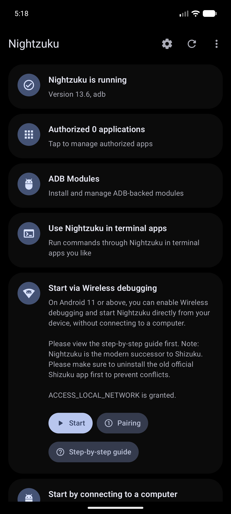
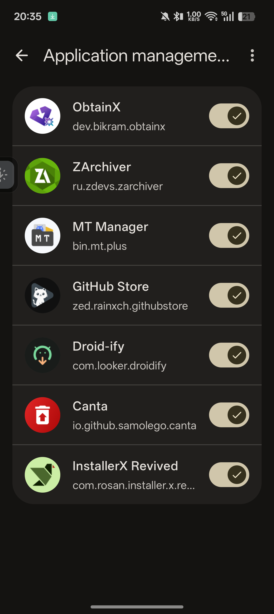
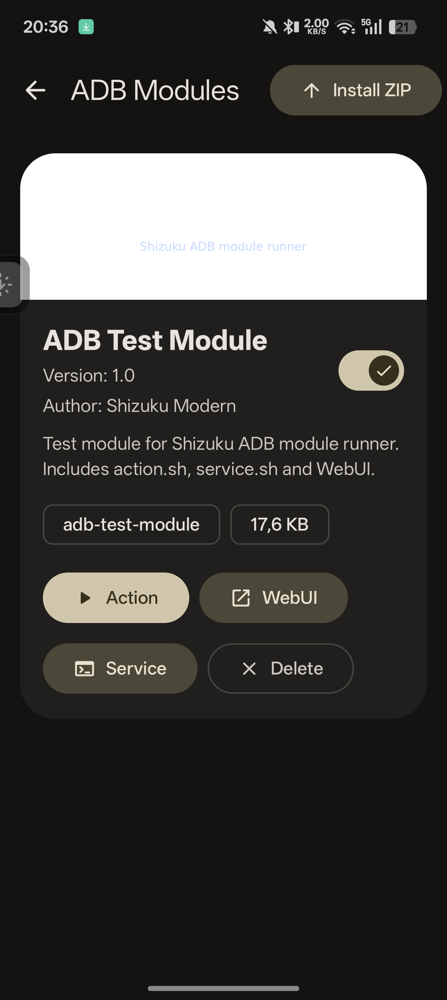
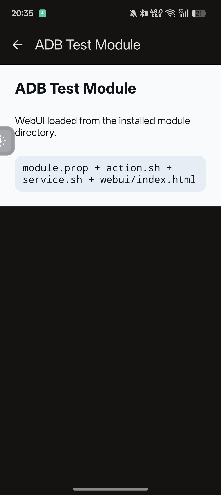
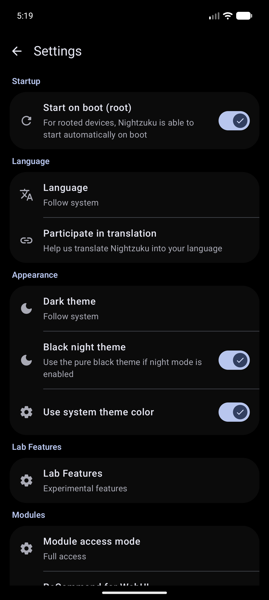
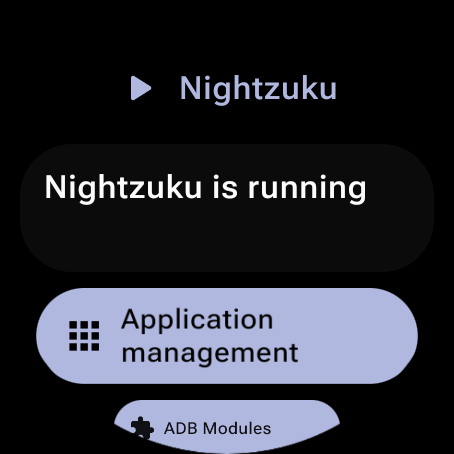
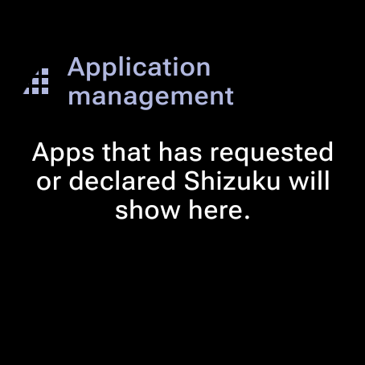
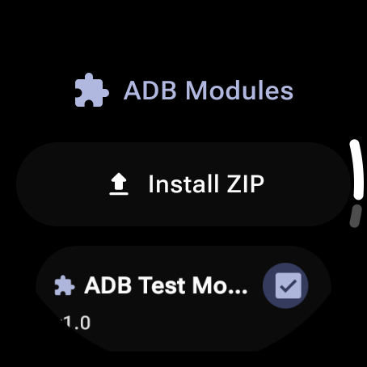
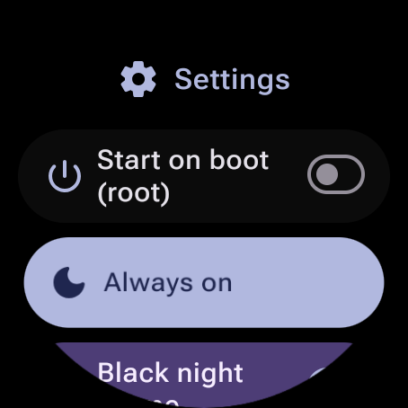
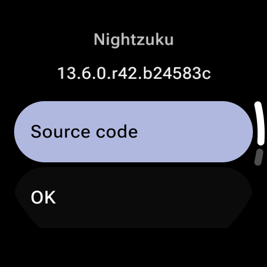

# Nightzuku

**Nightzuku** is a customized modern fork of **Shizuku**, maintained by kerneldroid. It provides a robust, high-performance interface for applications to use system APIs directly with elevated permissions (root/ADB).

This project tracks the latest Android platform developments, including Android 16/17 target stability, introduces a revamped Modern Material 3 Expressive UI using Jetpack Compose, and includes a full ADB-backed ZIP modules runner.

> [!IMPORTANT]
> **Migration Action Required:** Due to the package identity upgrade (`moe.shizuku.privileged.api` -> `kerneldroid.nightzuku`), you **MUST UNINSTALL** any older official Shizuku Manager app from your device before installing Nightzuku. Otherwise, they will conflict.
Upstream project reference: <https://github.com/RikkaApps/Shizuku>

## Fork additions

- Jetpack Compose manager UI with Material 3 Expressive components, motion, switches, and rounded icon treatment.
- Android 16/17 target work with current preview SDK/build tooling in this fork.
- ADB Modules screen for installing and managing ZIP modules.
- Module features: `module.prop`, banner, enable/disable switch, `action.sh`, policy-gated `service.sh`, local WebUI, delete, path checks, size limits, output limits, and last-run logs.
- Module policy settings: Safe mode, Full access, and background action control.
- Debug test module under `test-modules/adb-test-module.zip`.

## Documentation

- [ADB Modules guide](docs/adb-modules-guide.md)
- [ADB Modules API reference](docs/adb-modules-api.md)
- [Nightzuku Connectors API](docs/nightzuku-connectors.md)
- [Android 17 Compatibility](docs/android-17-compatibility.md)
- [Wear OS Compatibility](docs/wearos-compatibility.md)
- [Wear OS Pairing Guide](docs/wearos-pairing.md)
- [Android TV Support](docs/android-tv-support.md)
- [NightDog Watchdog](docs/nightdog.md)

## Background

When developing apps that require root, the standard approach is running commands in a `su` shell. This is slow, unreliable due to text processing, and limited to available commands. Even with ADB, apps often require root for privileged operations.

Nightzuku provides a high-performance alternative by allowing apps to use system APIs directly with elevated permissions.

## How does Nightzuku work?

Android uses `binder` for interprocess communication (IPC) between apps and the system server. The system server checks the UID/PID of the client to enforce permissions.

Nightzuku guides users to start a Nightzuku server process with root or ADB. When an authorized app starts, it receives a binder to the Nightzuku server.

Nightzuku acts as a proxy, receiving requests from the app and forwarding them to the system server. This allows apps to use system APIs with the server's elevated permissions (root or ADB), making it almost identical to using system APIs directly.

## Screenshots

  
📸 Click to open Screenshot Gallery

   

  ### Phone UI
  <table>
    <tr>
      <td align="center"> <b>Main Screen</b></td>
      <td align="center"> <b>Authorized Apps</b></td>
    </tr>
    <tr>
      <td align="center"> <b>ADB Modules</b></td>
      <td align="center"> <b>Module WebUI</b></td>
    </tr>
    <tr>
      <td colspan="2" align="center"> <b>Settings</b></td>
    </tr>
  </table>

  ### Wear OS UI (Native Material 3)
  <table>
    <tr>
      <td align="center"> <b>Main Screen</b></td>
      <td align="center"> <b>Authorized Apps</b></td>
    </tr>
    <tr>
      <td align="center"> <b>ADB Modules</b></td>
      <td align="center"> <b>Settings</b></td>
    </tr>
    <tr>
      <td colspan="2" align="center"> <b>Theme Dialog</b></td>
    </tr>
  </table>

  ### Android TV UI (Native Material 3)
  <table>
    <tr>
      <td colspan="2" align="center"> <b>Main Screen</b></td>
    </tr>
    <tr>
      <td align="center"> <b>ADB Modules</b></td>
      <td align="center"> <b>Settings</b></td>
    </tr>
  </table>

## Developer guide

### API & sample

Official API and samples are available at: <https://github.com/RikkaApps/Shizuku-API>

### Technical Details

1. **ADB Permissions**: ADB permissions vary by system version. Check available permissions in the [Shell AndroidManifest](https://github.com/aosp-mirror/platform_frameworks_base/blob/master/packages/Shell/AndroidManifest.xml). Use `ShizukuService#getUid` or `ShizukuService#checkPermission` to verify server capabilities.

2. **Hidden API Restrictions**: From Android 9, hidden API usage is restricted. Use tools like [AndroidHiddenApiBypass](https://github.com/LSPosed/AndroidHiddenApiBypass) if necessary.

3. **Android 8.0 & ADB**: On API 26, ADB lacks permissions to use `registerUidObserver`. If your app process is not started by an Activity, you may need to start a transparent activity to trigger binder transmission.

4. **Direct `transactRemote` Usage**: Signatures for hidden APIs change between Android versions. While `ShizukuBinderWrapper` handles most cases, direct transaction calls must be carefully verified against the target platform's AIDL definitions.

## Developing Nightzuku

### Build

- Clone with `git clone --recurse-submodules`
- Build with Gradle: `./gradlew :manager:assembleDebug`

The `:manager:assembleDebug` task generates a debuggable server. Ensure "Always install with package manager" is checked in Android Studio to use the latest server code during debugging.

## License

All code is licensed under Apache 2.0.

- **Icon Usage**: You may not use `manager/src/main/res/mipmap*/ic_launcher*.png` for anything other than displaying Nightzuku.
- **Identity**: You may not use `Shizuku` as an app name or use `moe.shizuku.privileged.api` as an application ID in derived works. The current package identity is `kerneldroid.nightzuku`.

## Credits 

[**Razgame**](https://github.com/RazGame/Shizuku) for [app list fix](https://github.com/kerneldroid/Nightzuku/commit/6ea7e74984f860398760f5111a15083ea004c842)
